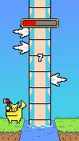

Pokeman
============
스마트폰 게임 프로그래밍 Term Project
2016180006 김동석
------------

## + 게임 컨셉
> * High Concept   
> 스팀게임인 팀버맨(Timberman)의 모작으로 기존의 게임에서 나무꾼이 나무를 패는 것이 아닌 피카츄가 갸라도스의 몸통을 공격하는 형태로 바뀌었다.  
>    
> * 핵심 메카닉   
> 플레이어는 피카츄가 갸라도스의 지느러미에 걸리지 않도록 좌우로 이동해가며 갸라도스의 몸통을 공격하며 화면 상단의 게이지가 전부 소모되거나 피카츄가 갸라도스의 지느러미에 부딪치면 게임이 끝나게 된다.   
>   
> </img> 
- - -
## + 진행 상황
> * 맵   
> 호수, 땅, 하늘이 분리되어 각각 움직인다. (100%)   
>    
> * 캐릭터 컨트롤러   
> 터치를 사용하여 플레이어가 좌우로 이동하며 공격 (100%)   
>    
> * 게임 주요기능
> 1. 플레이어와 장애물 간의 충돌 처리 (100%)
> 2. 탭 횟수만큼 스코어 증가(1회당 1점) (100%)
> 3. 스코어에 따라 새로운 캐릭터 잠금 해제(100, 150, 200점마다 잠금 해제) (0%)
> 4. 캐릭터가 공격할 때 몸통이 분리되어 날라가는 경로 무작위로 설정 (10%)
>    
> * 게임 난이도   
> 시간이 지날수록 게이지가 빨리 줄어들고 장애물(지느러미)가 자주 나온다. (20%)  
>    
> * 사운드   
> BackGround, Attack, Death, Click 사운드(총 4개) (0%)
>    
> * 캐릭터  
> 스코어에 따라 잠금 해제되는 캐릭터 3종 (60%)
>    
> * 애니메이션   
> Breath, Attack 캐릭터 애니메이션(총 2개) (100%)    
> </img>     
- - -
## + Git Commit
> </img> 
- - -
## + MainGame 에 등장하는 game object 들
> * Player    
> 그림 구성 : Idle, Attack 각각 2개의 애니메이션    
> </img>     
> 동작 구성    
> 가로 방향 중심을 기준으로 화면을 2개로 나눠 터치하는 부분에서 공격한다.
>    
> * Enemy   
> 그림 구성 : 플레이어를 방해하는 지느러미가 좌, 우, 무 3가지 종류가 있다.    
> </img>    
> 동작 구성   
> 플레이어가 공격시 사라진다.(날라가는 것으로 수정예정)   
> 지느러미가 있는 부분과 플레이어가 충돌하면 게임이 끝난다.
> 아래의 지느러미가 사라지면 위에서 내려온다.
>    
> * Score     
> 그림 구성 : 숫자로 구성(리소스 교체 예정)   
> </img> 
> 동작 구성
> 플레이어의 터치 횟수가 곧 점수이다.   
> 터치 횟수만큼 화면의 상단 중앙에 표시된다.
> 
> * Background   
> 그림 구성 : 낮과 밤을 표현     
> </img>     
> 동작 구성    
> 서서히 아래로 이동한다.   
> 낮과 밤이 바뀌는 효과를 준다
- - -
## + 어려웠던 부분     
> Background에 적이 포함되어있는데 화면 크기에 맞춰 생성하는 Background와 
> 오브젝트 크기를 그대로 그리는 적의 파츠의 크기가 어긋난다.    
> </img> 
> + Scene 관리하는 법에 대해서 배우고 싶습니다.    
- - -
