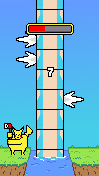
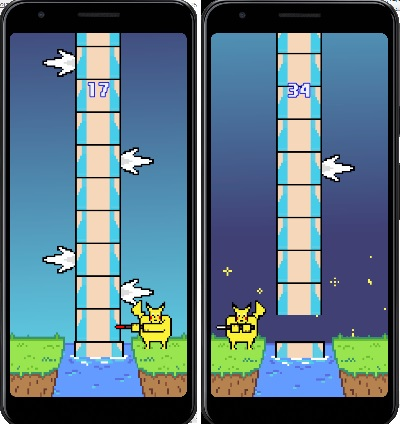
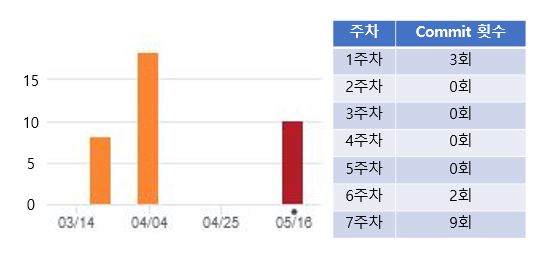

Pokeman
============
스마트폰 게임 프로그래밍 Term Project
2016180006 김동석
------------

## + 게임 컨셉
> * High Concept   
> 스팀게임인 팀버맨(Timberman)의 모작으로 기존의 게임에서 나무꾼이 나무를 패는 것이 아닌 피카츄가 갸라도스의 몸통을 공격하는 형태로 바뀌었다.  
>    
> * 핵심 메카닉   
> 플레이어는 피카츄가 갸라도스의 지느러미에 걸리지 않도록 좌우로 이동해가며 갸라도스의 몸통을 공격하며 화면 상단의 게이지가 전부 소모되거나 피카츄가 갸라도스의 지느러미에 부딪치면 게임이 끝나게 된다.   
>   
> </img> 
- - -
## + 진행 상황
> * 맵   
> 호수, 땅, 하늘이 분리되어 각각 움직인다. (100%)   
>    
> * 캐릭터 컨트롤러   
> 터치를 사용하여 플레이어가 좌우로 이동하며 공격 (100%)   
>    
> * 게임 주요기능
> 1. 플레이어와 장애물 간의 충돌 처리 (100%)
> 2. 탭 횟수만큼 스코어 증가(1회당 1점) (100%)
> 3. 스코어에 따라 새로운 캐릭터 잠금 해제(100, 150, 200점마다 잠금 해제) (90%)
> 4. 캐릭터가 공격할 때 몸통이 분리되어 날라가는 경로 무작위로 설정 (80%)
>    
> * 게임 난이도   
> 시간이 지날수록 게이지가 빨리 줄어들고 장애물(지느러미)가 자주 나온다. (100%)  
>    
> * 사운드   
> BackGround, Attack, Death, Click 사운드(총 4개) (100%)
>    
> * 캐릭터  
> 스코어에 따라 잠금 해제되는 캐릭터 3종 (100%)
>    
> * 애니메이션   
> Breath, Attack 캐릭터 애니메이션(총 2개) (100%)    
> </img>     
- - -
## + Git Commit
> </img> 
- - -
## + 개발 내용
> * 사용된 기술     
> 1. 오브젝트 재활용    
> 2. IndexedAnimationGameBitmap    
> 3. 사운드
> 4. 최대 스코어 기록(게임 재시작 기능)    
> 5. 충돌 처리
>    
> * 참고한 것들
> 1. 자바 관련된 함수들은 구글에서 검색    
> 2. 수업에서 배운 코드들 복습
>   
> * 수업내용에서 차용한 것    
> 1. 백그라운드 스크롤링      
> 2. 기본적인 프레임워크   
> 3. 오브젝트 관리      
>    
> * 직접 개발한 것   
> 1. 기둥(적)이 칸별로 고정되고 제거한 적을 재활용 하는 것    
> 2. 리소스    
> 3. 체력바 시스템    
> 4. 난이도 설정 시스템    
>    
- - -
## + 아쉬운 것들     
> * 하고 싶었지만 못 한 것들    
> 1. Scene 관리 - Scene을 여러개로 나누어서 관리    
> 2. 캐릭터 언락 시스템 - Scene을 구현하지 못해서 구현 불가    
>    
> * 팔기 위해 보충할 것들    
> 1. 언락되는 캐릭터의 개수
> 2. 기기별 호환성 - 현재 화면 크기가 다르면 약간씩 오브젝트가 어긋남    
>    
> * 결국 해결하지 못한 문제     
> 버그는 전부 해결, 기기별 화면 맞춤 설정을 해야한다.    
>   
> * 어려웠던 점    
> 기둥 오브젝트를 재활용하려고 코딩할때 클릭하는 속도와 기둥을 생성하는 속도가 어긋나      
> 중간이 비는 문제를 해결하는데 시간을 매우 많이 투자했다.    
- - -
